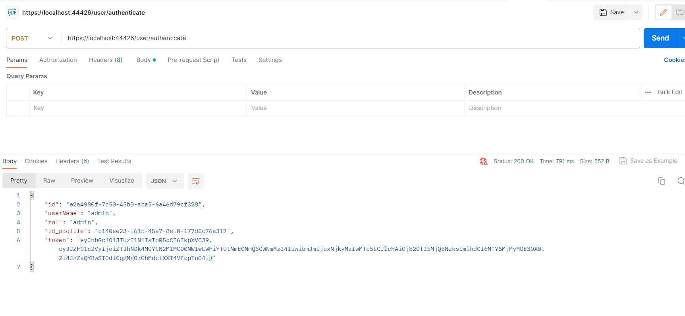
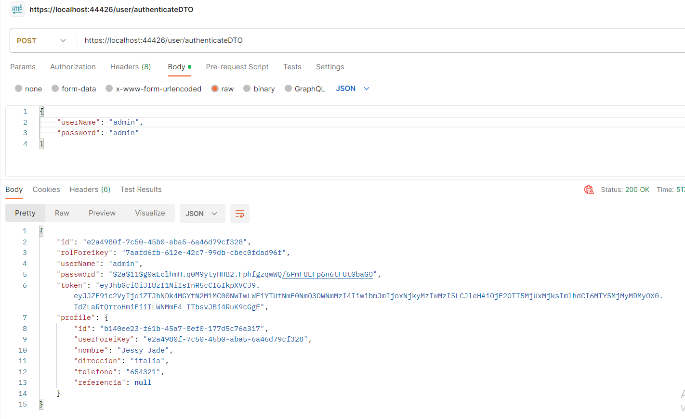
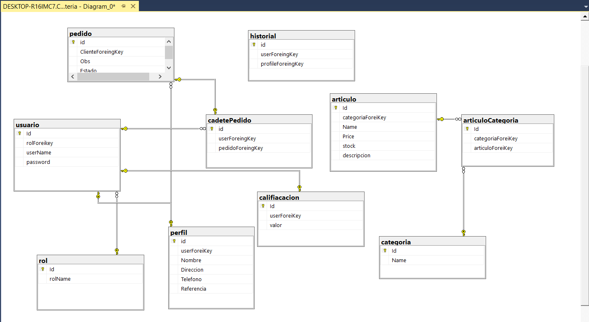
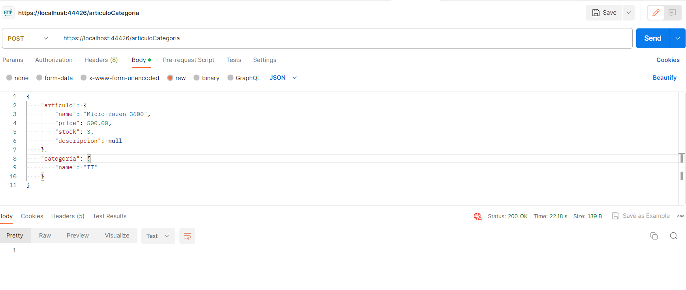
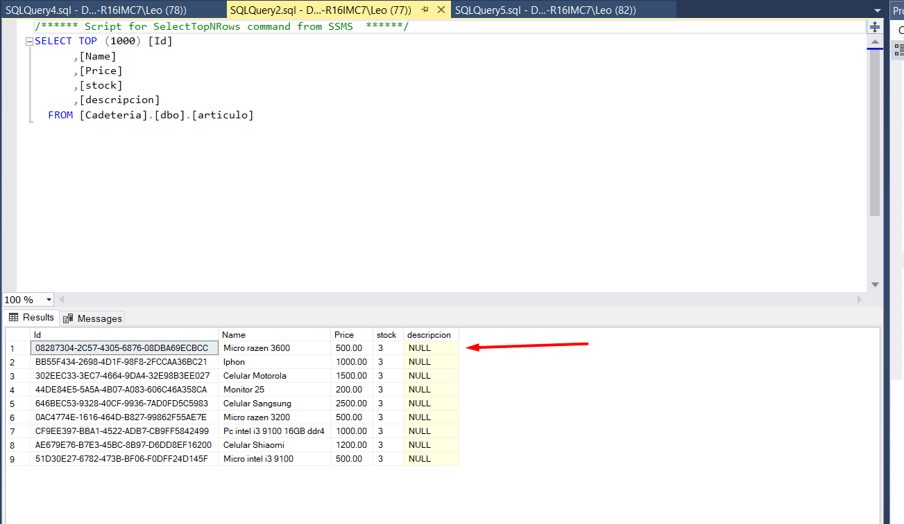
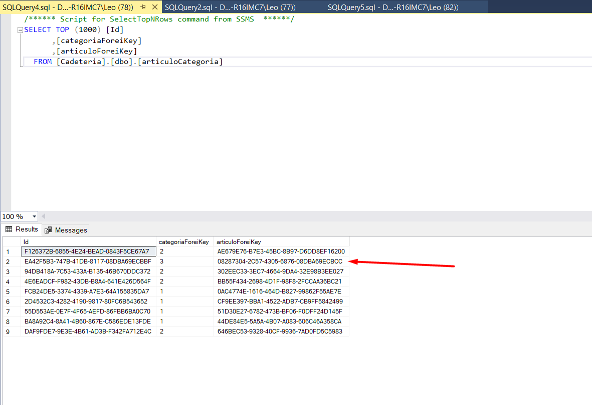
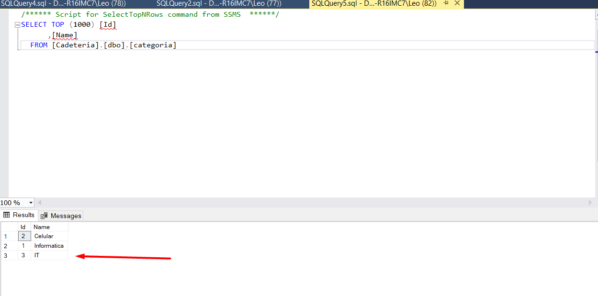
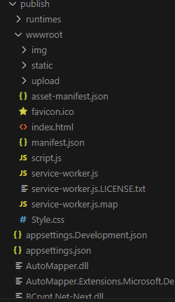

# Proyecto React-asp .net

Desde esta parte Vamos a empezar a tocar temas mas puntuales. En esta oportunidad vamos a ver una funcion bastante interesante de Automapper que nos permitira Ahorrarnos el problema de los Join y la inicializacion de valores.

## ¿Qué es ProjectTo?

Para dejarlo en simple palabras ProjectTo es una herramienta mas que nos brinda automapper. Esta herramienta nos va a permitir mapear de una forma mas comoda y lejible nuestras consultas. Tomemos el ejemplo anterior cuando teniamos que inicializar nuestras Clase para poder guardar en una clase el resultado de una consulta Join.
**Ejemplo pasado**

    public List<JoinResponse> GetUserJoin(int page)
    {
        List<JoinResponse> data = new List<JoinResponse>();

        var pagedData = _context.Users.Join(_context.rols, us => us.rolForeikey, r => r.Id,
            (us, r) => new { us.Id, us.userName, us.rolForeikey, r.rolName })
            .Join(_context.Profile, us => us.Id, pr => pr.userForeiKey, (us, p) => new
            { us.rolName, p.id, p.userForeiKey, p.Direccion, p.Telefono, p.Nombre, p.Referencia })
            .Skip((page - 1) * 1)
            .Take(1);

        foreach (var item in pagedData)
        {
            data.Add(new JoinResponse()
            {
                Id = item.id,
                userForeiKey = item.userForeiKey,
                Direccion = item.Direccion,
                Nombre = item.Nombre,
                Referencia = item.Referencia,
                Telefono = item.Telefono,
                rolName = item.rolName
            });
        }

        return data;
    }

Esto era necesario, porque a este objeto nosotros lo usabamos para inicializar los valores de otro objeto que nos devolvia la respuesta de nuestra consulta.

¿Es posible hacerlo de una manera mas practica y sencilla? La respuuesta a nuestra pregunta es **si**.

>Nota: Para incentivar la creatividad y las mentes de todos, no voy a resolver aqui mismo el este caso, sino que voy a usar la funcion de autenticacion de usuarios como ejemplo.

Comencemos creando nuestras clases DTO que nos daran lo que necesitamos para nuestras consultas.

**Path./DTOs/ProfileDTO.cs**

    namespace Cadeteria.DTOs;

    public class ProfileDTO
    {
        public Guid Id { get; set; }
        public Guid userForeiKey { get; set; }
        public string Nombre { get; set; }
        public string Direccion { get; set; }
        public string Telefono { get; set; }
        public string? Referencia { get; set; }

    }

**Path./DTOs/UserDTO.cs**

    namespace Cadeteria.DTOs;

    public class UserDTO
    {
        public Guid Id { get; set; }
        public Guid rolForeikey { get; set; }
        public string userName { get; set; }
        public string password { get; set; }
        public virtual ProfileDTO? Profile { get; set; }
    }

Ahora que creamos nuestras Clases necesitamos decirle a automapper que queremos que nos relacione estas dos entidades con nuestros modelos.

**Path:./Helpers/AutoMapperProfile**

    namespace Cadeteria;

    using AutoMapper;
    using Cadeteria.DTOs;
    using Cadeteria.Models;

    public class AutoMapperProfile : AutoMapper.Profile
    {
        public AutoMapperProfile()
        {

            // User -> AuthenticateResponse
            CreateMap<User, AuthenticateResponse>();

            // RegisterRequest -> User
            CreateMap<RegisterRequest, User>();

            // UpdateRequest -> User
            CreateMap<UpdateRequest, User>()
                .ForAllMembers(x => x.Condition(
                    (src, dest, prop) =>
                    {
                        // ignore null & empty string properties
                        if (prop == null) return false;
                        if (prop.GetType() == typeof(string) && string.IsNullOrEmpty((string)prop)) return false;

                        return true;
                    }
                ));

            CreateMap<Pedido, PedidoResponce>();
            CreateMap<PedidoResponce, Models.Profile>()
                .ForMember(
                    des => des.Nombre,
                    opt => opt.MapFrom(src => src.Nombre)
                );

            CreateMap<User, UserDTO>();
            CreateMap<Models.Profile, ProfileDTO>();

        }
    }

>Nota: noten aqui que esta clase AutoMapperProfile hereda de AutoMapper.Profile. Normalemnte no es necesario anteponer Autommaper Cuando haces el Using, pero debido a que hay dos clases con el mismo nombre es necesario declarar de que clase vienen.

Con estas dos lineas de codigo podemos comenzar a trabajar. Para este caso, en vez de remplazarlo voy a crear un nuevo metodo que haga lo mismo y voy a mostrar la diferencia.

**Path:./Controllers/UserController.cs**

    [Authorize]
    [ApiController]
    [Route("[controller]")]
    public class UserController : ControllerBase
    {
        private IUserRepository _userRepository;
        DataContext _db;
        private IMapper _mapper;
        private readonly AppSettings _appSettings;

        public UserController(
            IUserRepository userService,
            DataContext db,
            IMapper mapper,
            IOptions<AppSettings> appSettings)
        {
            _userRepository = userService;
            _db = db;
            _mapper = mapper;
            _appSettings = appSettings.Value;
        }

        [AllowAnonymous]
        [HttpPost("authenticate")]
        public IActionResult Authenticate(AuthenticateRequest model)
        {
            var response = _userRepository.Authenticate(model);
            //SetSesion(response);
            return Ok(response);
        }
        [AllowAnonymous]
        [HttpPost("authenticateDTO")]
        public IActionResult Authenticate2(AuthenticateRequest model)
        {
            var response = _userRepository.AuthenticateDTO(model);
            return Ok(response);
        }
    }

Como pueden ver tengo dos paginas que hacen practicamente lo mismo. buscan un usuario y si estan en la DB devuelven la respuesta que queremos o un error en caso contrario.

**Path:./Services/repositories/UserRepository.cs**

     public AuthenticateResponse Authenticate(AuthenticateRequest model)
    {
        var user = _context.Users.SingleOrDefault(x => x.userName == model.UserName);
        // validate
        if (user == null || !BCrypt.Verify(model.Password, user.password))
            throw new AppException("Username or password is incorrect");

        var prof = _context.Profile.SingleOrDefault(x => x.userForeiKey == user.Id);
        var Rol = _context.rols.SingleOrDefault(x => x.Id == user.rolForeikey);

        // authentication successful
        var response = _mapper.Map<AuthenticateResponse>(user);
        response.Token = _jwtUtils.GenerateToken(user);
        response.Rol = Rol.rolName;

        response.id_profile = (prof != null) ? prof.id : null;
        return response;
    }
    public UserDTO AuthenticateDTO(AuthenticateRequest model)
    {
        var user = _context.Users.SingleOrDefault(x => x.userName == model.UserName);
        // validate
        if (user == null || !BCrypt.Verify(model.Password, user.password))
            throw new AppException("Username or password is incorrect");

        var response = _context.Users.ProjectTo<UserDTO>(_mapper.ConfigurationProvider)
        .Where(x => x.Profile.userForeiKey == user.Id)
        .SingleOrDefault();
        response.Token = _jwtUtils.GenerateToken(user);

        return response;
    }

La diferencia es clara y aunque tenemos que hacer algunos pequeños cambios, no es nada de otro mundo y a cambio de la claridad en nuestro codigo vale la pena.

## Creacion de Articulos y obtencion de registros con tablas relacionadas 

Como ya dominamos como agregar nuevas tablas con Fluent Api, voy a compartir los modelos, dejando a ustedes las creacion de las relaciones.

**Path:./Models/Articulos.cs**

    using System.ComponentModel.DataAnnotations.Schema;
    using System.Text.Json.Serialization;

    namespace Cadeteria.Models;

    public class Articulo
    {
        public Guid Id { get; set; }
        public int categoriaForeiKey { get; set; }
        public string Name { get; set; }
        public decimal Price { get; set; }
        public int stock { get; set; }
        public string? descripcion { get; set; }

        [NotMapped]
        [JsonIgnore]
        public List<Categoria> categorias { get; set; }
        [NotMapped]
        [JsonIgnore]
        public List<ArticuloCategoria> ArticuloCategoria { get; set; }

    }

**Path:./Models/ArticulosCategoria.cs**

        using System.ComponentModel.DataAnnotations.Schema;
        using System.Text.Json.Serialization;

        namespace Cadeteria.Models;

        public class ArticuloCategoria
        {
            public Guid Id { get; set; }
            public int categoriaForeiKey { get; set; }
            public Guid articuloForeiKey { get; set; }

            [NotMapped]
            [JsonIgnore]
            public virtual Articulo? Articulo { get; set; }

            [NotMapped]
            [JsonIgnore]
            public virtual Categoria? Categoria { get; set; }
        }
**Path:./Models/Categoria.cs**

    using System.ComponentModel.DataAnnotations.Schema;
    using System.Text.Json.Serialization;

    namespace Cadeteria.Models;

    public class Categoria
    {
        public int Id { get; set; }
        public string Name { get; set; }
        [NotMapped]
        [JsonIgnore]
        public List<Articulo> articulos { get; set; }
        [NotMapped]
        [JsonIgnore]
        public List<ArticuloCategoria> ArticuloCategoria { get; set; }
    }

**Path:./Models/Calificacion.cs**

    using System.ComponentModel.DataAnnotations.Schema;
    using System.Text.Json.Serialization;

    namespace Cadeteria.Models;

    public class Calificacion
    {
        public int Id { get; set; }
        public Guid userForeiKey { get; set; }
        public int? valor { get; set; }

        [NotMapped]
        [JsonIgnore]
        public virtual User? User { get; set; }

    }

Como pueden ver nuestro proyecto cada vez vas tomando mas forma. Ahora seguramente te estaras preguntando porque los articulos estan "en el aire"(no tiene relacion). La respues a eso es porque solo nos concentraremos en hacer un buscador de productos que contengan un filtro.

Veamos la entidades de nuestro dataContext para la creacion de la base de datos.

    public class DataContext : DbContext
    {
        public DbSet<Profile> Profile { get; set; }
        public DbSet<Pedido> Pedido { get; set; }
        public DbSet<Historial> CadCliente { get; set; }
        public DbSet<CadetesPedido> CadPed { get; set; }
        public DbSet<User> Users { get; set; }
        public DbSet<Rol> Rols { get; set; }
        public DbSet<Articulo> Articulo { get; set; }
        public DbSet<ArticuloCategoria> ArticuloCategoria { get; set; }
        public DbSet<Categoria> Categoria { get; set; }

        public DataContext(DbContextOptions<DataContext> options) : base(options) { }
        protected override void OnModelCreating(ModelBuilder modelBuilder)
        {
            ...

            modelBuilder.Entity<Calificacion>(Calificacion =>
            {
                Calificacion.ToTable("califiacacion");
                Calificacion.HasKey(p => p.Id);
                Calificacion.Property(p => p.Id).IsRequired().ValueGeneratedOnAdd();
                Calificacion.Property(p => p.valor).HasDefaultValue(0);

                Calificacion.HasOne(us => us.User).WithOne(p => p.Calificacion)
                .HasForeignKey<Calificacion>(p => p.userForeiKey)
                .OnDelete(DeleteBehavior.Cascade);

            });

            modelBuilder.Entity<Articulo>(art =>
            {
                art.ToTable("articulo");
                art.HasKey(p => p.Id);
                art.Property(art => art.Id).IsRequired().ValueGeneratedOnAdd();
                art.Ignore(art => art.categoriaForeiKey);

                art.Property(art => art.Name).HasMaxLength(150);
                art.Property(art => art.descripcion).HasMaxLength(250);
                art.Property(art => art.descripcion).IsRequired(false);
                art.Property(art => art.Price).HasColumnType("decimal(18,2)");

                art.HasMany(art => art.ArticuloCategoria)
                .WithOne(art => art.Articulo).HasForeignKey(art => art.Id);

                art.HasData(listaDb2.ListArticulos());

            });

            modelBuilder.Entity<Categoria>(cat =>
            {
                cat.ToTable("categoria");
                cat.HasKey(p => p.Id);
                cat.Property(cat => cat.Id).IsRequired().ValueGeneratedOnAdd();

                cat.Property(cat => cat.Name).IsRequired().HasMaxLength(20);
                cat.HasIndex(cat => cat.Name).IsUnique();

                cat.HasData(listaDb2.ListCategorias());
            });

            modelBuilder.Entity<ArticuloCategoria>(AC =>
            {
                AC.ToTable("articuloCategoria");
                AC.HasKey(p => p.Id);
                AC.Property(AC => AC.Id).IsRequired().ValueGeneratedOnAdd();

                AC.HasOne(p => p.Articulo)
                .WithMany(p => p.ArticuloCategoria)
                .HasForeignKey(ac => ac.articuloForeiKey)
                .OnDelete(DeleteBehavior.Cascade);

                AC.HasOne(p => p.Categoria)
                .WithMany(p => p.ArticuloCategoria)
                .HasForeignKey(ac => ac.categoriaForeiKey)
                .OnDelete(DeleteBehavior.Cascade);

                AC.HasData(listaDb2.ListaArtC());

            });
        }
    }

>Nota: los valores numericos y decimales tenemos que aclarar los valores predeterminados. como pueden ver en esta seccion codigo *art.Property(art => art.Price).HasColumnType("decimal(18,2)");* determinamos que el valor maximo que puede alcanzar es de 18 digitos y que tendra dos digitos a la derecha.

Lista la base de datos y los modelos, solo nos queda crear el controlador que se conectara a la base de datos por nosotros y la implementacion de servicios.

**Path:Controllers/ArticuloCategoriaController.cs**

    using Cadeteria.DTOs;
    using Cadeteria.Models;
    using Microsoft.AspNetCore.Mvc;

    namespace Cadeteria;

    [Route("[controller]")]
    public class ArticuloCategoriaController : ControllerBase
    {
        private readonly DataContext _db;
        private readonly IArticuloCategoriaRepository _articulo;
        private readonly ILogger<ArticuloCategoriaController> _logger;

        public ArticuloCategoriaController(ILogger<ArticuloCategoriaController> logger, IArticuloCategoriaRepository articulo, DataContext db)
        {
            _db = db;
            _articulo = articulo;
            _logger = logger;
        }

        [HttpGet]
        public IActionResult Get()
        {
            try
            {
                var response = _articulo.Get();

                return Ok(new PagedResponse<IEnumerable<ArticuloCategoriaDTO>>(
                response, 2 / 1, 1));
            }
            catch (System.Exception e)
            {
                Console.WriteLine("no se pudo: \n" + e.ToString());
                return Ok("no se pudo: \n" + e.ToString());
            }
        }
        

    }

**Path:Services/IArticuloCategoriaRepository.cs

    using Cadeteria.DTOs;
    using Cadeteria.Models;
    using AutoMapper;
    using AutoMapper.QueryableExtensions;
    using LinqKit;

    namespace Cadeteria;

    public interface IArticuloCategoriaRepository
    {
        IEnumerable<ArticuloCategoriaDTO> Get();

    }

    public class ArticuloCategoriaRepository : IArticuloCategoriaRepository
    {

        DataContext context;
        private readonly IMapper _mapper;
        public ArticuloCategoriaRepository(DataContext dbContext, IMapper mapper)
        {
            context = dbContext;
            _mapper = mapper;
        }

        public IEnumerable<ArticuloCategoriaDTO> Get()
        {

            var response = context.ArticuloCategoria
            .ProjectTo<ArticuloCategoriaDTO>(_mapper.ConfigurationProvider)
            .ToList();
            return response;
        }

    }

Con esta simple instruccion podemos obtener los resultados de nuestra base de datos. **Ojo** observe que el PagaResponse todavia no se esta usando simplemente devolvemos valores sin determinar una secuencia.En el archivo del Automapper vamos a agregar las relaciones.

**Path:./Helpers/AutoMapperProfile.cs**

    public class AutoMapperProfile : AutoMapper.Profile
    {
        public AutoMapperProfile()
        {

            // User -> AuthenticateResponse
            CreateMap<User, AuthenticateResponse>();

            // RegisterRequest -> User
            CreateMap<RegisterRequest, User>();

            // UpdateRequest -> User
            CreateMap<UpdateRequest, User>()
                .ForAllMembers(x => x.Condition(
                    (src, dest, prop) =>
                    {
                        // ignore null & empty string properties
                        if (prop == null) return false;
                        if (prop.GetType() == typeof(string) && string.IsNullOrEmpty((string)prop)) return false;

                        return true;
                    }
                ));

            CreateMap<User, UserDTO>();
            CreateMap<Models.Profile, ProfileDTO>();
            CreateMap<Rol, RolDTO>();

            CreateMap<ArticuloCategoria, ArticuloCategoriaDTO>()
            .ForMember(x => x.Articulos, op => op.MapFrom(x => x.Articulo))
            .ReverseMap();
            CreateMap<Articulo, ArticuloDTO>().ReverseMap();
            CreateMap<Categoria, CategoriaDTO>().ReverseMap();

        }
    }

Ahora solo vamos a nuestro archivo program y inyectamos la dependencias para que todo funcione.

    builder.Services.AddScoped<IArticuloCategoriaRepository, ArticuloCategoriaRepository>();

## Filtrado

Para comenzar a filtrar vamos a tener que implementar un nuevo paquete.

    dotnet add package LinqKit --version 1.2.4

¿Porque usamos este paquete? La razon de usar este paquete es porque nos facilita la declaracion de predicados. Tomemeos en cuenta el ejemplo que vamos a hacer. En tres tablas tenemos toda la informacion sobre los productos que ofrecera nuestra aplicacion.

A medida que cresca sera necesario filtar tal informacion, para ello tenemos como criterios de filtros los mismo valores de las tablas.

**Path:./Helpers/FilterArticulo.cs**

    namespace Cadeteria;
    public class FilterArticulo
    {
        public string? ArticuloName { get; set; }
        public string? CategoriaName { get; set; }
        public decimal? PriceMin { get; set; }
        public decimal? PriceMax { get; set; }
    }

**Path:./Services/ArticuloCAtegoriaRepository.cs**

    public class ArticuloCategoriaRepository : IArticuloCategoriaRepository
    {
        ...
        //Si asi es, murio mi neuronas
        public List<ArticuloCategoriaDTO> Get2(FilterArticulo filtro)
        {
            var response = context.ArticuloCategoria
            .ProjectTo<ArticuloCategoriaDTO>(_mapper.ConfigurationProvider)
            .Where(predicate)
            .Where(x => x.Categoria.Name.Contains(filtro.CategoriaName))
            .Where(x => x.Articulos.Name.Contains(filtro.ArticuloName))
            .Where(x => x.Articulos.Price >= filtro.PriceMin && x.Articulos.Price <= filtro.PriceMax)
            .ToList();
            return response;
        }
    }

Si nosotros hacemos esto, primero filtrara todo los resultados de acuerdo a la categoria, luego de ese resultado filtrara por el nombre del articulo y por ultimo traera aquellos que esten en el rango de precio que establecimos.

Aunque esto pueda funcionar, tiene un fuerte problema, si alguno de los valores no esta, simplemente no traera nada. Aqui es donde entra esta nueva libreria.

    public class ArticuloCategoriaRepository : IArticuloCategoriaRepository
    {
        ...
        //Si asi es, murio mi neuronas
        public List<ArticuloCategoriaDTO> Get2(FilterArticulo filtro)
        {
            //En el caso de ser mas, siempre se puede usar un foreach
            var predicate = PredicateBuilder.New<ArticuloCategoriaDTO>();
            predicate = predicate.Or(p => p.Articulos.Name.Contains(filtro.ArticuloName));
            predicate = predicate.Or(p => p.Categoria.Name.Contains(filtro.CategoriaName));
            predicate = predicate.Or(p => p.Articulos.Price >= filtro.PriceMin && p.Articulos.Price <= filtro.PriceMax);

            var response = context.ArticuloCategoria
            .ProjectTo<ArticuloCategoriaDTO>(_mapper.ConfigurationProvider)
            .Where(predicate)
            //.Where(x => x.Categoria.Name.Contains(filtro.CategoriaName))
            //.Where(x => x.Articulos.Name.Contains(filtro.ArticuloName))
            //.Where(x => x.Articulos.Price >= filtro.PriceMin && x.Articulos.Price <= filtro.PriceMax)
            .ToList();
            return response;
        }
    }

De esta manera, si alguno de los atributos que colocamos en nuestro archivo filtro falta, simplemente lo ignora.

## Creacion de vista para los filtro.

Para la interfast no vamos a hacer uso de algo diferente a lo que ya vimos. Si vamos a tener que tener algunas consideraciones al momento de emplear el objeto que nos determinara los valores que necesitaremos para el filtro.

Antes de comenzar, les sugiero hacer la prueba en Postman, hay veremos que si nosotros no enviamos un objeto, a pesar de esperarlo, este se comportara de la misma manera como si nunca hubiesemos determinado el predicado. Sin embargo, si nosotros enviamos un objeto con todos sus atributos nulos, este no devolvera nada, por lo que debemos tener, minimo, un atributo con un string vacio.

    const filtro = {
        articuloName: "",
        categoriaName: "",
        PriceMin: null,
        PriceMax: null
    }

De esta manera al tener articuloName o cadeteriaName como atributo con string vacio, traeremos todos los objeto y podremos determinar un estandar. Esta me ha parecido la forma mas facil de mostrarlo. Veamos ahora el codigo para la interfast.

**Path:./ClientApp/src/component/articulos/silderbar.js**

    import React, { useState } from "react";
    import 'bootstrap/dist/css/bootstrap.min.css';
    import 'bootstrap-icons/font/bootstrap-icons.css';

    const SilderBar = ({ filtro, setFiltro, db }) => {

        const [form, setForm] = useState(filtro);
        const style = {
            sidebar: {
                width: "280px",
                height: `calc(100vh)`,
                position: "sticky",
                left: 0,
            },
        };

        const handleChange = (e) => {
            setForm({
                ...form,
                [e.target.name]: e.target.value
            });
        };

        const handelSubmit = (e) => {
            e.preventDefault();
            var array = []
            for (const clave in form) {
                if (form[clave]) {
                    array.push([clave, form[clave]])
                }
            }
            var obj = Object.fromEntries(array)
            setFiltro(obj);
        }

        return (
            <>
                <button className="btn btn-primary" type="button" data-bs-toggle="collapse" data-bs-target="#collapseWidthExample" aria-expanded="false" aria-controls="collapseWidthExample">
                    
                </button>
                <section className="bd-highlight me-4 collapse-horizontal" id="collapseWidthExample">
                    

                        <form onSubmit={handelSubmit}>
                            

                                <svg className="bi me-2" width="40" height="32"><a href="#" /></svg>
                                Sidebar 
                            

                            

                            

                                

                                    

                                        <button className="btn btn-toggle  text-white rounded collapsed" type="button" data-bs-toggle="collapse" data-bs-target="#collapseCategoria" aria-expanded="false" aria-controls="collapseCategoria">
                                            Categoria
                                        </button>
                                        

                                            

                                                <select className="form-select"
                                                    onChange={handleChange} name="categoriaName"
                                                >
                                                    <option defaultValue={""} value={""} placeholder="Select">Ninguno</option>
                                                    {db.length > 0 ?
                                                        (db.map((data) =>
                                                            <option
                                                                value={data.name}
                                                                key={data.id}
                                                            >{data.name}</option>
                                                        )) : (
                                                            <option>Error en Db</option >
                                                        )}
                                                </select>
                                            

                                        

                                    

                                    

                                    

                                        <button className="btn btn-toggle text-white rounded collapsed" type="button" data-bs-toggle="collapse" data-bs-target="#collapsePrecio" aria-expanded="false" aria-controls="collapsePrecio">
                                            Precio
                                        </button>
                                        

                                            

                                                <label htmlFor="inputNumber" className="col-sm-2 col-form-label">Min</label>
                                                

                                                    <input type="number" className="form-control" placeholder="Min Price" name="priceMin" id="inputNumber"
                                                        value={form.priceMin} onChange={handleChange} />
                                                

                                            

                                            

                                                <label htmlFor="inputNumberMax" className="col-sm-2 col-form-label">Max</label>
                                                

                                                    <input type="number" className="form-control" placeholder="Max Price" name="priceMax" id="inputNumberMax"
                                                        value={form.priceMax} onChange={handleChange} />
                                                

                                            

                                        

                                    

                                    

                                    

                                        <button className="btn btn-toggle  text-white rounded collapsed" type="button" data-bs-toggle="collapse" data-bs-target="#collapseArticulo" aria-expanded="false" aria-controls="collapseArticulo">
                                            Articulo
                                        </button>
                                        

                                            

                                                <input className="form-control me-2" type="text" placeholder="Name" name="articuloName" aria-label="Search"
                                                    value={form.articuloName} onChange={handleChange} />
                                            

                                        

                                    

                                

                            

                            

                                

                                    <button className="btn btn-outline-success me-2" type="submit">Search</button>
                                

                            

                        </form>
                    

                </section >
            </>
        )
    }

    export default SilderBar;

En nuestro Sildebar vamos recibir la informacion del componente padre con la que manejaremos el filtro que condicionara la busqueda.

**Path:./ClientApp/src/component/articulos/Card.js**

    import React from "react";

    const Card = ({ data }) => {
        const { id, articulos, categorias } = data

        return (
            

                

                    
                    

                        <h6>{articulos.name}</h6>
                        <h6>${articulos.price}</h6>
                        <button className="btn btn-primary" >Add cart</button>
                    

                

            

        );
    };

    export default Card;

En nuestro componente Card vamos a renderizar en forma de carta los articulos devuelto por la base de datos. Como estos articulos pueden ser muchos, no es bueno traer una gran cantidad, por lo que podemos limitar la consulta de la misma manera que lo hicimos con la **Paginacion**.

No obstante como ya trabajamos con un sistema de paginacion, vamos ahora a hacer un boton de **Ver Mas** que agregara el resultado de nuestra busqueda al primer resultado de nuestra respuesta a la base de datos.

**Path:./ClientApp/src/component/articulos/index.js**

    import React, { useEffect, useState } from "react"
    import SilderBar from "./SilderBar";
    import "./card.css"
    import Card from "./card";
    import { helpHttp } from "./../../Helper";
    import Loader from "../Loader";
    import { GlobalContext } from "../../ApiContext";

    const InitialForm = {
        articuloName: "",
        categoriaName: "",
        PriceMin: null,
        PriceMax: null
    }

    const initialRow = {
        totalPages: 0,
        pageNumber: 0,
        data: [],
        succeeded: true,
        errors: null,
        message: ""
    }

    const Articulo = () => {
        const [row, setRow] = useState(initialRow);
        const [filtro, setFiltro] = useState(InitialForm);
        const [disable, setDisable] = useState(true);
        const urlLocal = "/articuloCategoria/filtro/"

        const {
            db,
            setUrl,
            loading,
        } = React.useContext(GlobalContext)

        const isObjectEmpty = (objectName) => {
            return (
                objectName &&
                Object.keys(objectName).length === 0 &&
                objectName.constructor === Object
            );
        };

        setUrl("/articuloCategoria/categorias")

        if (isObjectEmpty(filtro)) {
            setFiltro(InitialForm)
        }
        useEffect(() => {
            let options = {
                body: filtro,
                headers: { "content-type": "application/json" },
            };
            helpHttp().post(urlLocal, options).then((res) => {
                if (res.err) {
                    //setError(res);
                    setDisable(false)
                } else {
                    setRow(res);
                    setDisable(true)
                }
            })
        }, [filtro])

        useEffect(() => {
            if (row.totalPages == row.pageNumber) {
                setDisable(false)
            }
        })

        const handelAdd = () => {
            let options = {
                body: filtro,
                headers: { "content-type": "application/json" },
            };
            helpHttp().post(`${urlLocal}/${row.pageNumber + 1}`, options).then((res) => {
                if (res.err) {
                    //setError(res);
                    console.log(res)
                } else {
                    var array = [...row.data, ...res.data]
                    setRow({
                        ...row,
                        ["totalPages"]: res.totalPages,
                        ["pageNumber"]: res.pageNumber,
                        ["data"]: array
                    }
                    );
                }
            })
        }

        return (
            <>
                

                    <SilderBar
                        setFiltro={setFiltro}
                        filtro={filtro}
                        db={db}
                    />
                    

                        

                            

                                {loading && <Loader />}
                                {row.data && (
                                    row.data.length > 0 ? (
                                        row.data.map((data, index) =>
                                        (<Card key={index}
                                            data={data}
                                        />)
                                        )) : (
                                        

                                            no hay datos
                                        

                                    ))}
                            

                        

                        {disable && (
                            

                                <button className="btn btn-outline-dark" type="button" onClick={handelAdd}>Ver mas</button>
                            
)
                        }
                    

                

            </>
        )
    }
    export default Articulo;

>Nota: En la carpeta [helpers](./Helpers/ListDb2.cs) tengo un archivo llamado ListDB2 que tiene algunos valores con los que se puede probar.

## Insercion de registros con tablas relacionadas.

Hasta ahora hemos visto, la facilidad con la cual obtenemos los registros gracias a Entity Framework y a las funciones de mapeo. Ahora ¿podemos hacer el mismo metodo para tomar una solicitud Post?

Vamos a nuestro controlador para ponerlo a prueba.

**Path:./Controllers/ArticuloCategoriaController.cs**

    ...
    [HttpPost]
    public IActionResult Post([FromBody] ArticuloCategoriaDTO articulo)
    {
        try
        {
            var request = _mapper.Map<ArticuloCategoria>(articulo);
            _articulo.Save(request);
            return Ok();
        }
        catch (System.Exception e)
        {
            Console.WriteLine("error: \n" + e.ToString());
            throw;
        }
    }

>Nota: es importante convertirlo en un articuloCategoria Despues de todo, nuestro DataContext espera un tipo especifico de archivo.

**Path:./Services/ArticuloCategoriaRepository.cs**

    ...
        public async Task Save(ArticuloCategoria artCad)
    {

        context.ArticuloCategoria.Add(artCad);
        await context.SaveChangesAsync();
    }

Aqui comenzamos a ver la primera diferencia, antes para hacer una solicitus Post solo necesitabamos solo hacer uso del metodo "Add" para obtener el resultado. Veamos como lo hicimos para guardar datos en nuestro perfil.

    public async Task Save(Profile profile)
    {
        context.Add(profile);
        await context.SaveChangesAsync();
    }

Esto es necesario, porque tenemos que indicar el archivo padre que contendra los datos que vamos a insertar en nuestra base de datos. Con estos cambios vamos a Postman para realizar probar si es posible o no insertar en multiples tablas con una sola consulta

Vemos como Entity Framework lo hizo de nuevo. Gracias a estos podemos olvidarnos de muchos de los problemas que tubimos al separar la informacion ingresada por los usuarios.

## Subir archivo a la base de datos y Formulario multipaso

En la actualidad es muy comun que un nuestras aplicaciones web tengan que maniputar distintos tipos de archivos. Ya sea documentos como Pdf, videos o imagenes. Para esto tenemos que pensar cuidadosamente como vamos a relacionar estos archivos.

Sin pensarlo mucho uno puede llegar a la conclucion que la tabla con la que se tiene que relacionar tiene una relacion de uno a muchos. Sin embargo, por lo menos en este ejemplo. vemos que podemos usar imagenes para el perfil y imagenes para los articulos.

¿Como determinaremos la relaciones con las tablas? Si llegaste a pensar que podemos tener la misma tabla en la de los perfiles y la de los productos. Tendrias algunos problemas si tu base de dato fue creada con el motor de Entity Framework. ya que habria un conflicto con las claves foraneas.

Ahora incluso si pudieras hacerlo andar, no seria lo mas optimo, despues de todo, mientras mas grande sea la tabla, mas pesada es la busqueda por lo que lo mas recomendable En mi punto de vista es tener dos tablas separadas.

**Path:./Models/Archivo.cs**

    public class Archivo
    {
        public Guid Id { get; set; }
        public Guid articulolForeiKey { get; set; }
        public string Name { get; set; }
        public string Foto { get; set; }

        [NotMapped]
        [JsonIgnore]
        public Articulo articulo { get; set; }
    }

**Path:./Models/user/ArchivoPerfil.cs**

    public class ArchivoPerfil
    {
        public Guid Id { get; set; }
        public Guid perfilForeiKey { get; set; }
        public string Name { get; set; }
        public string Foto { get; set; }

        [NotMapped]
        [JsonIgnore]
        public Profile perfil { get; set; }

    }

>Nota: Las relaciones en Ef la dejo para que cada uno pueda hacerlo. ya que no es algo nuevo.

**Path:./Controllers/ArticuloCategoriaController.cs**

    [HttpPost]
    public async Task<IActionResult> Post([FromForm] ArticuloCategoriaResponseDTO articulo)
    {
        try
        {
            var data = ArchivoHelpers.CreateArchivo(articulo, _evriroment);
            var request = _mapper.Map<ArticuloCategoria>(data);
            await _articulo.Save(request);
            return Ok(request);
        }
        catch (System.Exception e)
        {
            Console.WriteLine("error: \n" + e.ToString());
            throw;
        }
    }

Preste atencion ahora porque ya no recibimos un dato tipo FromBody, sino uno de tipo FromFrom. En el metodo Post invocamos una nueva clase estatica que nos va a devolver un objeto mapeable.

**Path:./Helpers/ArchivoHelpers.cs**

    //si no tengo imaginacion
    public static ArticuloCategoriaCreateDTO CreateArchivo(ArticuloCategoriaResponseDTO response, IWebHostEnvironment _evriroment)
        {
        ArticuloCategoriaCreateDTO data = new ArticuloCategoriaCreateDTO();
        List<ArchivoCreateDTO> aux = new List<ArchivoCreateDTO>();
        if (response.Foto != null)
        {
            string nameImagen;
            if (!Directory.Exists(Path.Combine(_evriroment.ContentRootPath, "upload")))
            {
                Directory.CreateDirectory(Path.Combine(_evriroment.ContentRootPath, "upload"));
            }
            foreach (var item in response.Foto)
            {
                aux.Add(ConvertArchivo(_evriroment, item));
            }
            data.Articulo = new ArticuloCreateDTO()
            {
                Name = response.ArticuloName,
                Price = response.Price,
                descripcion = response.descripcion,
                stock = response.stock,
                archivos = aux
            };
        }
        else
        {
            data.Articulo = new ArticuloCreateDTO()
            {
                Name = response.ArticuloName,
                Price = response.Price,
                descripcion = response.descripcion,
                stock = response.stock,
            };
        }
        data.Categoria = new CategoriaDTO() { Name = response.CategoriaName };

        return data;
    }

    public static ArchivoCreateDTO ConvertArchivo(IWebHostEnvironment _evriroment, IFormFile archivo)
    {
        string ficherosImagenes = Path.Combine(_evriroment.ContentRootPath, "upload");
        var a = Path.Combine(Directory.GetParent(Directory.GetCurrentDirectory()).Parent.FullName);

        string nameImagen = $"{Path.GetRandomFileName()}.png";
        string rutaDefinitiva = Path.Combine(ficherosImagenes, nameImagen);
        using (var fileStream = new FileStream(rutaDefinitiva, FileMode.Create))
        {
            archivo.CopyTo(fileStream);
        };

        return new ArchivoCreateDTO { Name = nameImagen, Foto = rutaDefinitiva };
    }

>**Nota: aqui nosotros inicializamos el objeto que necesitamos para guardar en nuestra base de datos, aunque esto funciona, no es correcto, despues de todo se supone que una funcion solo debe hacer lo que su nombre indica. Tampoco es correcto guardar el archivo antes de que se guardara en la base de datos, porque podria haber un problema y el archivo existiria, pero su registro no**

Aqui lo que hacemos es recorrer el array de archivos que enviamos, les damos un nombre generico aleatorio como sugiere la bibliografia y la clase enviromente nos va a permitir obtener la ruta raiz donde se encuentra. De esa manera podemos determinar el nombre y la ruta donde guardarlo.
Luego hacemos una copia, aunque la copia tendria que hacerse despues de asegurar que guardamos el archivo en la base de datos y unicializamos los datos que mapeamos.

**Path:./Helpers/AutoMapperProfile.cs**

    public AutoMapperProfile()
    {
        ...

        CreateMap<ArticuloCategoria, ArticuloCategoriaDTO>()
        .ForMember(x => x.Articulo, op => op.MapFrom(x => x.Articulo))
        .ReverseMap()
         .ForMember(x => x.Articulo, op => op.MapFrom(x => x.Articulo));
        CreateMap<ArticuloCategoriaCreateDTO, ArticuloCategoria>()
            .ForMember(x => x.Articulo, articulo => articulo.MapFrom(ar => ar.Articulo))
            .ForPath(x => x.Articulo.archivos, archivo => archivo.MapFrom(ar => ar.Articulo.archivo))
            .ReverseMap();
    }

Para el formulario que enviara toda esta informacion vamos a usar un formulario de multiples pasos

**Path:./CientApp/src/components/FormArticulo/index.js**

    import React, { useEffect, useState, useRef } from "react";
    import "./formArt.css";
    import { GlobalContext } from "../../ApiContext";
    import 'bootstrap/dist/css/bootstrap.min.css';
    import 'bootstrap-icons/font/bootstrap-icons.css';
    import axios from "axios"
    import { useNavigate } from "react-router-dom";

    const initialForm = {
        articuloName: "",
        price: 0,
        stock: 0,
        descripcion: "",
        categoriaName: "",
        archivo: []
    }

    const FormArticulo = () => {

        const [form, setForm] = useState(initialForm);
        const [foto, setFoto] = useState([]);
        const [imgFile, setImgFile] = useState("https://cdn-icons-png.flaticon.com/512/573/573119.png");
        const current = useRef(1);
        const nav = useNavigate();

        const slidePageRef = useRef();
        const progressTextRef = useRef();
        const progressCheckRef = useRef();
        const bulletRef = useRef();
        const progressTextRef2 = useRef();
        const progressCheckRef2 = useRef();
        const bulletRef2 = useRef();
        const progressTextRef3 = useRef();
        const progressCheckRef3 = useRef();
        const bulletRef3 = useRef();
        const progressTextRef4 = useRef();
        const progressCheckRef4 = useRef();
        const bulletRef4 = useRef();

        const {
            db,
            setUrl,
            CreateWihtUrl
        } = React.useContext(GlobalContext)

        setUrl("/articuloCategoria/categorias")

        const ClassAdd = () => {
            switch (current.current) {
                case 1:
                    bulletRef.current.classList.add("active");
                    progressCheckRef.current.classList.add('active');
                    progressTextRef.current.classList.add("active");
                    break;
                case 2:
                    bulletRef2.current.classList.add("active");
                    progressCheckRef2.current.classList.add("active");
                    progressTextRef2.current.classList.add("active");
                    break;
                case 3:
                    bulletRef3.current.classList.add("active");
                    progressCheckRef3.current.classList.add("active");
                    progressTextRef3.current.classList.add("active");
                    break;
                case 4:
                    bulletRef4.current.classList.add("active");
                    progressCheckRef4.current.classList.add("active");
                    progressTextRef4.current.classList.add("active");
                    break;
                default:
                    break;
            }
        }
        const ClassRemove = () => {
            switch (current.current) {
                case 1:
                    bulletRef.current.classList.remove("active");
                    progressCheckRef.current.classList.remove('active');
                    progressTextRef.current.classList.remove("active");
                    break;
                case 2:
                    bulletRef2.current.classList.remove("active");
                    progressCheckRef2.current.classList.remove("active");
                    progressTextRef2.current.classList.remove("active");
                    break;
                case 3:
                    bulletRef3.current.classList.remove("active");
                    progressCheckRef3.current.classList.remove("active");
                    progressTextRef3.current.classList.remove("active");
                    break;
                case 4:
                    bulletRef4.current.classList.remove("active");
                    progressCheckRef4.current.classList.remove("active");
                    progressTextRef4.current.classList.remove("active");
                    break;
                default:
                    break;
            }
        }

        const HandelClick = (e) => {
            e.preventDefault();
            slidePageRef.current.style.marginLeft = `-${current.current * 25}%` //"-25%";
            ClassAdd();
            current.current++;
        }

        const HandelPreView = (e) => {
            e.preventDefault();
            var margin = (current.current === 1) ? "0%" : `-${(current.current - 2) * 25}%`
            slidePageRef.current.style.marginLeft = margin;
            current.current--;
            ClassRemove();
        }

        const handelSubmit = async (e) => {
            e.preventDefault();
            ClassAdd();
            let formData = new FormData();

            formData.append('ArticuloName', form.articuloName);
            formData.append('price', form.price);
            formData.append('categoriaName', form.categoriaName);
            formData.append('descripcion', form.descripcion);
            formData.append('stock', form.stock);
            for (let index = 0; index < foto.length; index++) {
                formData.append('foto', foto[index]);
            }
            await axios.post("/articuloCategoria", formData)
                .then(response => {
                    setTimeout(function () {
                        console.log(response.data);
                        nav("/articulo")
                    }, 800);
                }).catch(err => console.log(err))
        }

        const handleChange = (e) => {
            setForm({
                ...form,
                [e.target.name]: e.target.value,
            });
        };

        useEffect(() => {
            //current.current = 1
            //imgFile.current = "https://cdn-icons-png.flaticon.com/512/573/573119.png"
        }, [imgFile])

        const subirARchivos = (e) => {
            setFoto([...foto, ...e.target.files])
            const reader = new FileReader()
            reader.onload = function (e) {
                setImgFile(e.target.result)
            }
            reader.readAsDataURL(e.target.files[0])
        }

        return (
            

                

                    <h1>Registrar Cliente</h1>
                    

                        

                            
Paso 1

                            

                                1
                            

                            

                        

                        

                            
Paso 2

                            

                                2
                            

                            

                        

                        

                            
Paso 3

                            

                                3
                            

                            

                        

                        

                            
Fin

                            

                                4
                            

                            

                        

                    

                    {/* <!-- Formulario --> */}
                    

                        <form onSubmit={handelSubmit}>
                            

                                

                                    <label htmlFor="ArticuloName" className="label-art">Nombre del producto</label>
                                    <input type="text" name="articuloName" id="articuloName" onChange={handleChange} value={form.articuloName} />
                                

                                

                                    <label htmlFor="price" className="label-art">Precio</label>
                                    <input type="number" name="price" id="price" onChange={handleChange} value={form.price} />
                                

                                

                                    <label htmlFor="stock" className="label-art">Stock</label>
                                    <input type="number" name="stock" id="stock" onChange={handleChange} value={form.stock} />
                                

                                

                                    <button className="firstNext next" onClick={HandelClick} >Siguiente</button>
                                

                            

                            

                                {/* //
Información de Contacto
 */}
                                

                                    <label htmlFor="categoriaName1" className="label-art">Categoria</label>
                                    <select className="form-select"
                                        onChange={handleChange} name="categoriaName" id="categoriaName1"
                                    >
                                        <option defaultValue={""} placeholder="Select">Ninguno</option>
                                        {db.length > 0 ?
                                            (db.map((data) =>
                                                <option
                                                    value={data.name}
                                                    key={data.id}
                                                >{data.name}</option>
                                            )) : (
                                                <option>Error en Db</option >
                                            )}
                                    </select>
                                

                                

                                    <label htmlFor="categoriaName" className="label-art">Nueva Categoria</label>
                                    <input type="text" name="categoriaName" id="categoriaName" onChange={handleChange} value={form.categoriaName} />
                                

                                

                                    <button className="prev-1 prev" onClick={HandelPreView}>Atrás</button>
                                    <button className="next-1 next" onClick={HandelClick}>Siguiente</button>
                                

                            

                            

                                
Imagen del producto
                                    <label htmlFor="img" className="label-art">
                                        
                                    </label>
                                    <input type="file" id="img" value={form.archivo}
                                        onChange={(e) => subirARchivos(e)}
                                        name="foto" style={{ display: "none", visibility: "hidden" }}
                                        multiple />
                                    {/* //   */}
                                

                                

                                    <button className="prev-2 prev" onClick={HandelPreView}>Atrás</button>
                                    <button className="next-2 next" onClick={HandelClick}>Siguiente</button>
                                

                            

                            

                                

                                    <label htmlFor="descripcion" className="label-art">Descripcion Del Producto</label>
                                    <textarea name="descripcion" id="descripcion" onChange={handleChange} value={form.descripcion} cols="80" rows="3"></textarea>
                                

                                

                                

                                

                                    <button className="prev-3 prev" onClick={HandelPreView}>Atrás</button>
                                    <button className="submit">Enviar</button>
                                

                            

                        </form>
                    

                

            

        )
    }

    export default FormArticulo;

>Nota: Como siempre la hoja de estilo dentro de la carpeta.

Aqui voy a destacar dos cosas, la primera es que debido a que Js se inicializa antes que react termine de cargar. formas comunes de llamar a los elementos del DOM como querySelector o getElementByClassName no son utiles.

Una alternatica a esto es usar **useRef** que hace una referencia al elemento al que fue inicializado, ya sea una variable nueva o un elemento del DOM.

Otra cosa que voy a destacar, es que en esta parte, e implementado la libreria de Axio. para instalarla solo tiens que colocar el siguiente comando en la terminal donde se encuentra el proyecto de React.

    npm i axios

Lo demas es cuestion de llamarla y usarla de la misma manera que la hemos estado usando con nuestros proyectos.

¿Porque usar Axios? dejo aqui Un [link](https://www.freecodecamp.org/espanol/news/como-usar-axios-con-react/) para que entiendas un poco mas, pero en resumen, es una dependencia bastante desarrollada que nos podria facilitar la vida, pero como su nombre indica estas dependencias nos hace dependiente a ellas, por lo que no siempre esta bueno saber usar algo que no sabemos que hace por dentro.

## Clases estaticas o una nueva dependencia.

Recientemente para tratar con los archivos hemos creado una clase estatica para acceder a algunas funciones extra que necesitabamos hacer para guardar nuestros archivos.

y aunque funciona, tiene un gran problema y es que no se puede manejar los archivos de manera asincrona, por lo que esto puede implicar un problema en el futuro.

Una simple solucion es tratarla como lo hicimos a nuestros repositorio. Crearemos una nueva interfaz y una clase que herede de ella todas sus funciones, luego lo inyectaremos en nuestro archivo program y lo trataremos como una dependencia mas.

>Nota: dejo la resolucion como un reto, pero como siempre saben que la solucion esta en el archivo correspondiente dentro del repositorio.# React-Asp.net-4

## ¿Manejo de archivo por parte del backend o frontend?

Si probaron todo lo que hemos hecho hasta aqui sabran que hay algunos inconvenientes a la hora de guardar los archivos. Esto es debido a que usamos dos librerias distintas que trabajan en paralelo en el momento del desarrollo.

Cuando nosotros empaquetamos nuestro proyecto y lo subimos, todo estos archivos se combinan para formar una sola cosa. Para este caso en particular vemos que los archivos estaticos de React se trasladan a la carpeta de wwwroot y estos siguen funcionando correctamente porque hacen uso de las rutas dinamicas.

Seguramente compartiran el mismo pensamiento que yo: "¿Para que guardo el nombre y la direccion si solo necesito uno de los dos? Y ¿no seria mas facil manejar la ruta de manera dinamica?

La razon por la que guardamos las dos, es para evitar nuevos cambios que vamos a necesitar ahora. Y, la respuesta a la segunda pregunta es si. es mas facil manejarlo como una ruta dinamica, de esa manera solo tenemos que buscar el nombre del archivo en la carpeta estatica. Adicionalmente tengo que Recordar que este trabajo es puramente educativo, por lo que nos centraremos mas en aprender a como hacerlo que hacerlo correctamente desde el inicio.

>Recordatorio Amigable: Las puebas y errores son los pasos fundamentales que, segun mi humilde opinion, todo programador no puede evitar. Si nos conformamos con poco, nunca creceremos y si buscamos lo facil nunca seremos competentes.

Claro que esta respuesta esta condicionada a la pregunta ¿que tan grande es el proyecto? Una mejor organizacion hasta cierto punto nos permitira ahorranos trabajo y ser mas eficiente a la hora de la busqueda. Por ejemplo, Crear una nueva carpeta cada año. Por lo general el usuario tiende a usar la informacion y los archivos mas nuevos, por lo que los archivos viejos se van desplegando lentamente a otro servidores que tiene menos consumos.

De esta manera se puede economizar en gastos y el usuario puede obtener la informacion si es que lo necesitara en un futuro.

Volviendo al tema. Sabiendo ahora que todas las carpetas de archivos estaticos se moveran a la carpeta wwwroot ¿como podriamos hacer uso de las rutas estaticas para conseguir el mismo efecto?

La solucion es simple, simplemente en el periodo de desarrollo vas a crear la misma carpeta que se crea al guardar archivos en la carpeta public donde.

de esa manera podras simular lo que tendras en el hosting. Luego en los componentes que necesitan ser llamadas las imagenes vamos a usar **require.context():** require.contextes una característica especial admitida por el compilador de webpack que le permite obtener todos los módulos coincidentes a partir de algún directorio base.

Como siempre voy a mostrar un ejemplo y lo demas es cuestion de imitar el proceso en los demas componentes.

**Path:./ClientApp/src/components/articulos/card.js**

    import React, { useState } from "react";
    import { useNavigate } from "react-router-dom";

    const imgLocal = require.context("../../../public/upload", true)

    const Card = ({ data }) => {
        const { id, articulo, categorias } = data
        const nav = useNavigate()

        const handelError = (e) => {
            e.target.src = "./img/imgRota.jpg";
            e.target.onerror = null;
        }

        const handelClick = () => {
            nav("/ArticuloDetail/" + id)
        }

        const style = {
            img: {
                widgh: "280px",
                height: "180px"
            }
        }

        return (
            

                <a onClick={handelClick}>
                    

                        {/*  
                        
                        */}
                        
                        

                            <h6>{articulo.name}</h6>
                            <h6>${articulo.price}</h6>
                            <button className="btn btn-primary" >Add cart</button>
                        

                    

                </a>
            

        );
    };

    export default Card;

>Recordatorio: Siempre llamen al require.context al final de todas sus importaciones. para evitar problemas de importaciones no reconocidas.

Como podran notar la nueva forma de llamar es menos complicada que la anterior, Sin embargo, Segun nuestra aplicacion todavia permitimos a nuestro usuarios darle la opcion de subir o no archivos.

por lo que es necesario tener imagenes por defecto en el caso de no tener una imagen o por algun problema al traer informacion de la base de datos.

Si llegaste hasta Aqui **Felicidades completate el cuarto turorial.** Un saludo y nos vemos en la siguiente parte.